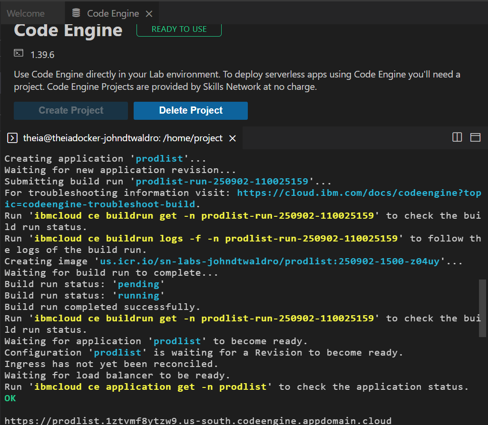
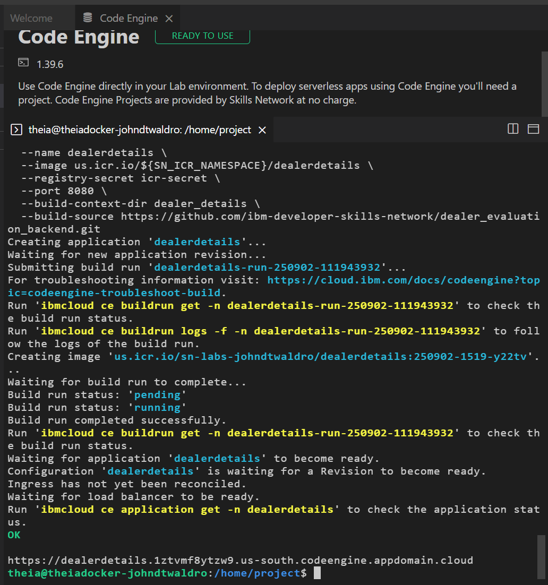
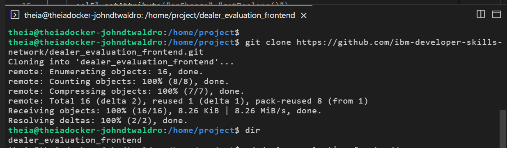
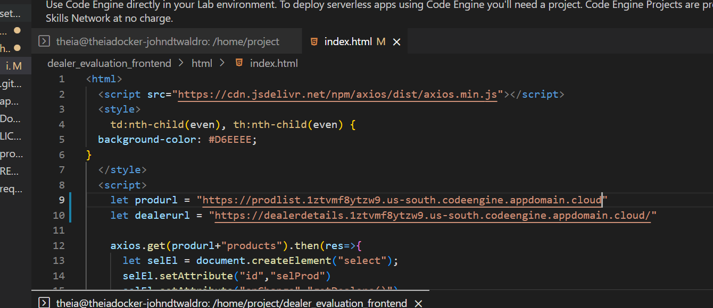
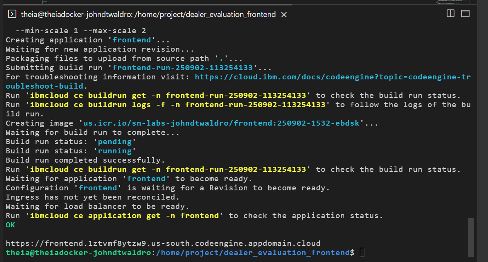
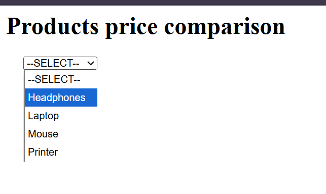
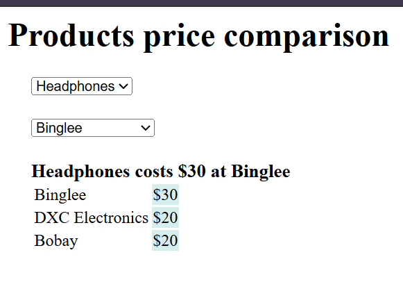
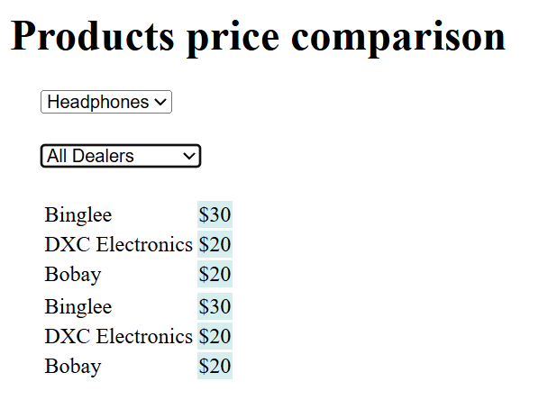

# IBM Application Development using Microservices & Serverless (PoW)

This repo documents my completion of the **IBM DevOps Microservices & Serverless course final project**.  
It serves as **Proof-of-Work (PoW)** for deploying microservices on IBM Cloud Code Engine.

---

## 📌 Part A: Backend Deployments

### 1. Product Details Microservice (Python, port 5000)
- ✅ Deployed with Code Engine from repo source (`products_list`).
- URL:  
  `https://prodlist.1ztvmf8ytzw9.us-south.codeengine.appdomain.cloud/`
- Screenshot:  
  

### 2. Dealer Details Microservice (Node.js, port 8080)
- ✅ Deployed with Code Engine from repo source (`dealer_details`).
- URL:  
  `https://dealerdetails.1ztvmf8ytzw9.us-south.codeengine.appdomain.cloud/`
- Screenshot:  
  

---

## 📌 Part B: Frontend Deployment

### 3. Cloned frontend repo
- Source: `https://github.com/ibm-developer-skills-network/dealer_evaluation_frontend.git`
- Screenshot:  
  

### 4. Updated index.html with backend URLs
- `produrl` → Product Details URL  
- `dealerurl` → Dealer Details URL  
- Screenshot:  
  

### 5. Frontend Deployed (port 5001)
- ✅ Deployed with Code Engine from local source.  
- URL:  
  `https://frontend.1ztvmf8ytzw9.us-south.codeengine.appdomain.cloud/`
- Screenshot:  
  

---

## 📌 Functional Proof (Screens from live app)

- **Homepage loaded with products**  
  

- **Product + Dealers list populated**  
  

- **Dealer-specific price displayed**  
  

- **All dealers’ prices displayed**  
  

---

## 🏁 Outcome

Successfully deployed a **Product Price Comparison Application** using **IBM Cloud Code Engine**, completing the course’s final project.

This repo demonstrates:
- Deploying microservices (Python Flask + Node.js Express) from GitHub source into Code Engine.  
- Building and running containers with ports 5000, 8080, and 5001.  
- Integrating frontend with backend microservices via public endpoints.  
- Validating functionality end-to-end with screenshots.  

---

📂 Repository Structure:

IBM.App.Dev.Microserv.serverless-JDW-POW/
├── product_details_deploy.png
├── dealer_details_deploy.png
├── git_clone.png
├── index_urlchanges.png
├── frontend_deploy.png
├── homepage.png
├── product_dealer.png
├── product_dealer_price.png
├── product_all_dealers_prices.png
└── README.md
