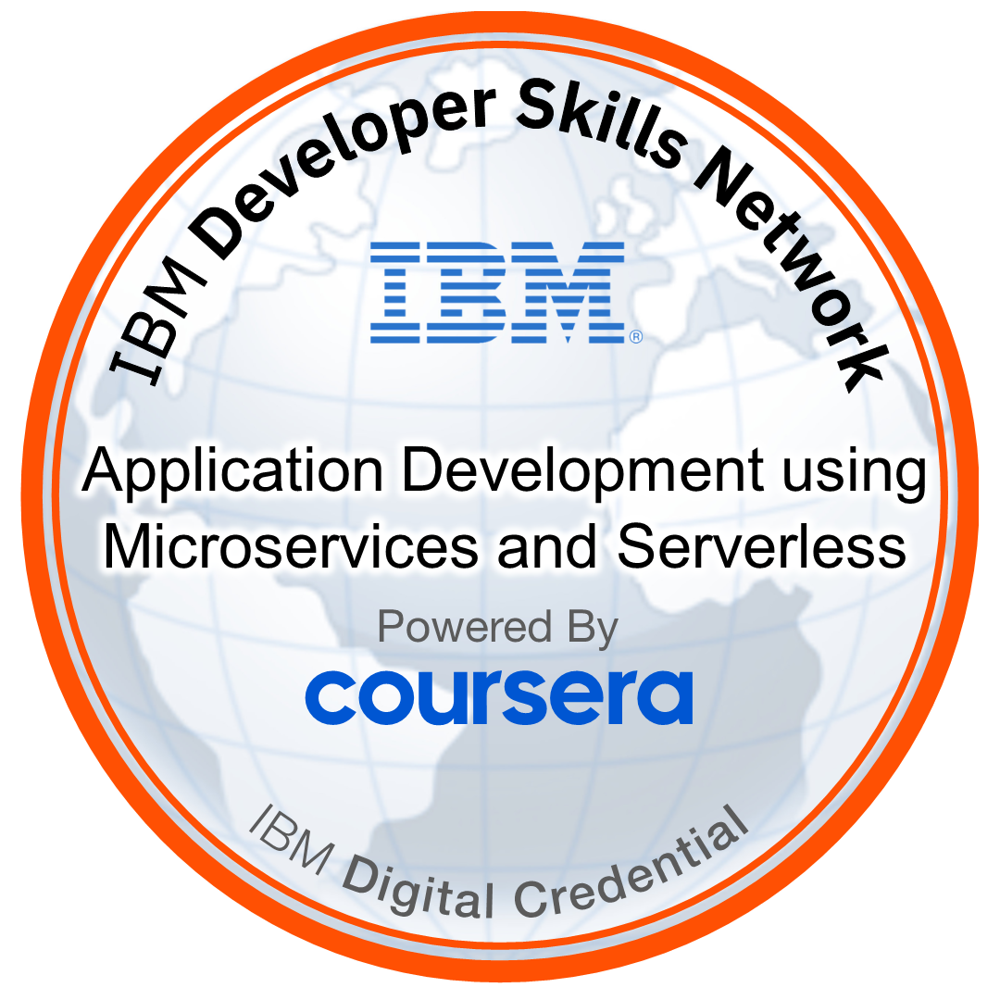

# IBM.App.Dev.Microserv.serverless-JDW-POW

📌 Proof-of-Work repo documenting my completion of the **IBM Application Development using Microservices and Serverless** course and final project on IBM Cloud Code Engine.

---

## 🎓 Certification

- **Coursera Certificate (Verify):** [0HXZ1SX88JQ1](https://www.coursera.org/account/accomplishments/verify/0HXZ1SX88JQ1)  
- **Credly Badge:** [Verify on Credly](https://www.credly.com/badges/2eb859b9-08fc-426d-953a-90297f143016)  



PDF copy of my issued certificate: [jdw-cert-IBMDesign20250902-30-b80wo7.pdf](jdw-cert-IBMDesign20250902-30-b80wo7.pdf)

---

## 📂 Project Overview

This project deployed **three microservices** on IBM Cloud Code Engine:

1. **Product Details (Python)**  
   Endpoint: `/products` → returns available products.

2. **Dealer Pricing (Node.js)**  
   Endpoint: `/dealers` → returns dealer pricing.

3. **Frontend (HTML/JS)**  
   Integrated the two backends to build a live price comparison tool.

---

## 🖼️ Screenshots

### Backend Deployments
- Product Details → `product_details_deploy.png`
- Dealer Details → `dealer_details_deploy.png`

### Frontend Deployments
- Git Clone → `git_clone.png`
- Index HTML updates → `index_urlchanges.png`
- Frontend Deploy → `frontend_deploy.png`

### Functional Tests
- Homepage → `homepage.png`
- Product & Dealers → `product_dealer.png`
- Product + Dealer + Price → `product_dealer_price.png`
- All Dealers Prices → `product_all_dealers_prices.png`

---

## 🛠️ Commands & Workflow

Key IBM Cloud CLI commands used:

```bash
# Deploy Product Details
ibmcloud ce app create \
  --name prodlist \
  --image us.icr.io/${SN_ICR_NAMESPACE}/prodlist \
  --registry-secret icr-secret \
  --port 5000 \
  --build-context-dir products_list \
  --build-source https://github.com/ibm-developer-skills-network/dealer_evaluation_backend.git

# Deploy Dealer Pricing
ibmcloud ce app create \
  --name dealerdetails \
  --image us.icr.io/${SN_ICR_NAMESPACE}/dealerdetails \
  --registry-secret icr-secret \
  --port 8080 \
  --build-context-dir dealer_details \
  --build-source https://github.com/ibm-developer-skills-network/dealer_evaluation_backend.git

# Deploy Frontend
ibmcloud ce app create \
  --name frontend \
  --image us.icr.io/${SN_ICR_NAMESPACE}/frontend \
  --registry-secret icr-secret \
  --port 5001 \
  --build-source .
